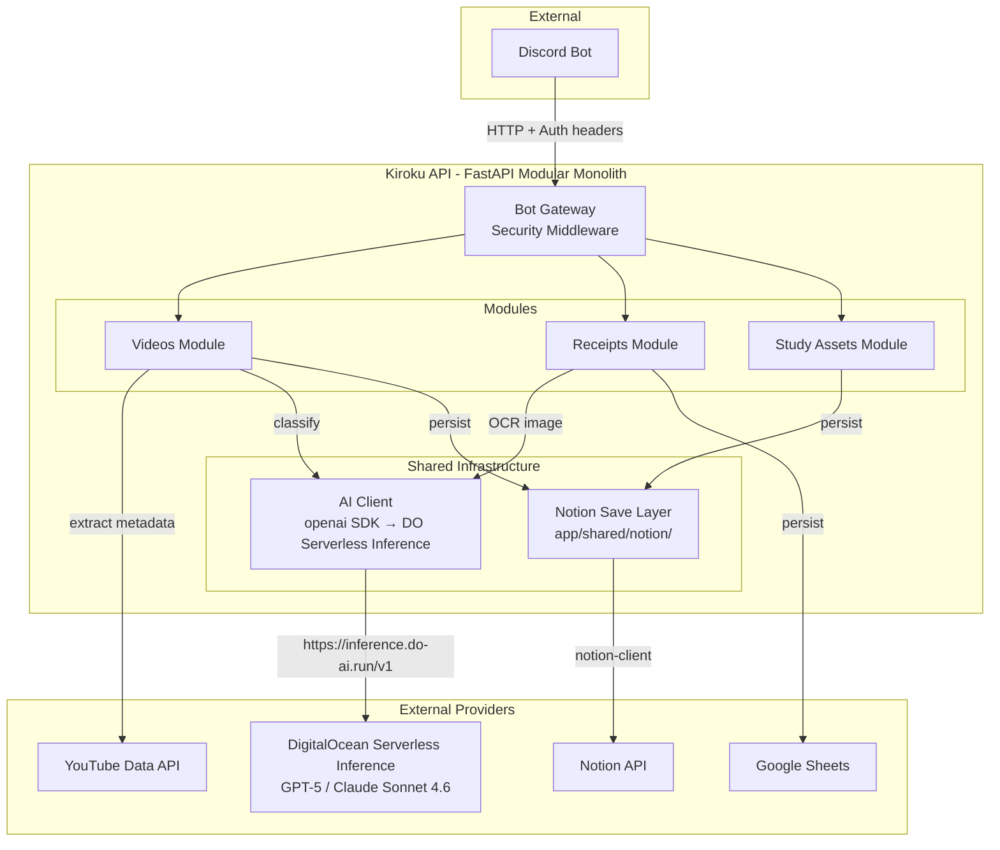

# Kiroku API

Kiroku API is a FastAPI modular monolith that automates metadata extraction, AI-powered classification, and idempotent persistence of YouTube videos into Notion.

## 🏗 Architecture



## 🚀 Features

- **Automated Metadata Extraction:** Safely extracts video title, channel name, tags, description, and game category using the YouTube Data API.
- **Cloud AI Classification:** Routes reasoning requests directly to DigitalOcean Serverless Inference, yielding high-accuracy output mapped to strict Notion schemas without requiring any local GPU or model hosting.
- **Single & Bulk API Processing:** Process a single URL or send batches through HTTP endpoints.
- **Smart Retries & Resilience:** Handles API rate-limits gracefully with exponential backoff (`tenacity`) for both the AI model and the Notion API.
- **Manual Priority Overrides:** Support for appending `high`, `medium`, `low`, or `later` next to a URL to bypass AI priority reasoning and forcefully push the video to a specific queue.
- **Added at Date:** Video entries include `Added at` based on configurable timezone (default `America/Bogota`).

## 📋 Prerequisites

1. **Python 3.13** (3.12 also supported)
2. **DigitalOcean Serverless Inference API Key** (Create a Model Access Key in your DigitalOcean account under Inference → Model Access Keys. Scope it to Serverless Inference with models `openai/gpt-5` and `anthropic/claude-sonnet-4-6`).
3. **Notion Internal Integration** with a generated API Token and a properly shared Notion Database. The database must have a `Channel` property (Text) configured.

## 🛠 Setup

1. **Clone the repository:**
   ```bash
   git clone git@github.com:KruzNicolas/Kiroku.git
   cd Kiroku
   ```

2. **Set up the virtual environment (using uv):**
   ```bash
   uv venv --python 3.13
   source .venv/bin/activate  # Linux/Mac
   # .venv\Scripts\activate    # Windows
   uv pip install -r requirements.txt
   ```

3. **Configure Environment Variables:**
   Copy the example config and fill in your credentials:
   ```bash
   cp .env.example .env
   ```
   Edit `.env` to include your exact `NOTION_TOKEN`, `NOTION_DATABASE_ID_VIDEOS`, `NOTION_DATABASE_ID_STUDY_ASSETS_JAPANESE`, `AI_API_KEY`, `AI_MODEL_VIDEO`, and `AI_MODEL_RECEIPTS`.

   Receipts -> Google Sheets integration:
   - `RECEIPTS_GOOGLE_SHEETS_URL=<your_apps_script_web_app_url>`
   - `RECEIPTS_GOOGLE_SHEETS_API_TOKEN=<POST_API_TOKEN_from_script_properties>`

   Optional video config:
    - `VIDEOS_ADDED_AT_TIMEZONE=America/Bogota`
    - `YOUTUBE_API_KEY=<your_google_api_key>`
    - `YOUTUBE_API_BASE_URL=https://www.googleapis.com/youtube/v3`

   Bot gateway hardening config:
   - `INTERNAL_API_TOKEN=<strong-random-token>`
   - `IDEMPOTENCY_TTL_SECONDS=86400`
   - `RATE_LIMIT_VIDEOS_PER_MIN=20`
   - `RATE_LIMIT_VIDEOS_BATCH_PER_MIN=10`
   - `RATE_LIMIT_RECEIPTS_PER_MIN=5`
   - `RATE_LIMIT_STUDY_ASSETS_JP_PER_MIN=15`

## 💻 API Usage

For full request/response contracts (headers, error cases, payload examples), see:

- [`API_ENDPOINTS_GUIDE.md`](./API_ENDPOINTS_GUIDE.md)

### Start the API

```bash
# Development (with reload)
uv run uvicorn app.main:app --host 0.0.0.0 --port 8000 --reload

# Production (MUST use 1 worker for in-memory rate limiter)
uv run uvicorn app.main:app --host 0.0.0.0 --port 8000 --workers 1
```

### 1. Health check

```bash
curl -X GET "http://127.0.0.1:8000/health"
```

### 2. Create one video record

```bash
curl -X POST "http://127.0.0.1:8000/api/v1/videos" \
  -H "Content-Type: application/json" \
  -H "Authorization: Bearer <INTERNAL_API_TOKEN>" \
  -H "X-Source: discord-bot" \
  -d '{"url":"https://www.youtube.com/watch?v=...", "manual_priority":"later"}'
```

### 3. Create videos in batch

```bash
curl -X POST "http://127.0.0.1:8000/api/v1/videos/batch" \
  -H "Content-Type: application/json" \
  -H "Authorization: Bearer <INTERNAL_API_TOKEN>" \
  -H "X-Source: discord-bot" \
  -d '{
    "items": [
      {"url": "https://www.youtube.com/watch?v=..."},
      {"url": "https://www.youtube.com/watch?v=...", "manual_priority": "low"}
    ],
    "max_workers": 3
  }'
```

Batch response includes `failed_urls` to quickly identify links that could not be persisted.

### 4. Create receipt entries from image

```bash
curl -X POST "http://127.0.0.1:8000/api/v1/receipts" \
  -H "Authorization: Bearer <INTERNAL_API_TOKEN>" \
  -H "X-Source: discord-bot" \
  -F "receipt_image=@/absolute/path/to/receipt.jpg" \
  -F "store_hint=Falabella" \
  -F "batch_category=Groceries" \
  -F "request_id=discord:guild123:channel456:message789"
```

Response returns line-item headers without `batch_id` and includes Google Sheets POST result.

Receipts endpoint accepts `image/jpeg` and `image/png` only.
If your source is HEIC/HEIF (common on iPhone), convert it to JPEG in the bot/client before sending.

Date note for receipts pipeline:
- OCR may infer dates in slash format, but Google Sheets upstream expects `YYYY-MM-DD`.
- The API now normalizes common date formats before POSTing to Apps Script.

Category note for receipts pipeline:
- OCR still extracts item category, but `batch_category` can override all items in the current receipt.
- Allowed values: `Groceries`, `Pharmacy`, `Transport`, `Utilities`, `Subscriptions`, `Debt`, `Leisure`, `Others`.

Quantity note for receipts pipeline:
- Quantity keeps decimal values for weighted products (e.g., `0.714`, `0.335`).

Price note for receipts pipeline:
- Receipts are handled as COP whole units.
- If OCR returns small decimal values (e.g., `2.95` for `2.950`), API normalizes to `2950` before sending to spreadsheet.

### 5. Create manual receipt entries (small purchases)

```bash
curl -X POST "http://127.0.0.1:8000/api/v1/receipts/manual" \
  -H "Content-Type: application/json" \
  -H "Authorization: Bearer <INTERNAL_API_TOKEN>" \
  -H "X-Source: discord-bot" \
  -d '{
    "date": "2026-03-24",
    "category": "Others",
    "store": "MercadoLibre",
    "items": [
      {"product": "Keyboard X", "quantity": 1, "price": 400000}
    ],
    "request_id": "discord:guild123:channel456:message789"
  }'
```

### 6. Create Japanese study asset (manual workflow)

```bash
curl -X POST "http://127.0.0.1:8000/api/v1/study-assets/japanese" \
  -H "Authorization: Bearer <INTERNAL_API_TOKEN>" \
  -H "X-Source: discord-bot" \
  -F "image=@/path/to/study-image.jpg;type=image/jpeg" \
  -F "note=for future manual anki cards"
```

This endpoint now expects `multipart/form-data`.

- `image` is required and accepts `image/jpeg` or `image/png`.
- `note` is optional text.
- API sets Notion `Status` to `Pending` and auto-generates a readable unique `Title`.
- API uploads binary image bytes through Notion File Upload API and attaches it to `Image` as `file_upload`.
- API creates a new page for each request (no module upsert key required).
- API also sets `Added at` using the same timezone-based date strategy as videos (`VIDEOS_ADDED_AT_TIMEZONE`, default `America/Bogota`).

Expected Notion properties for Japanese DB:

- `Title` (title)
- `Image` (files)
- `Status` (select)
- `Note` (rich_text)
- `Added at` (date)

## 🧪 Test Write Mode (optional)

If you run real API calls against your Notion database and want to identify test records quickly:

- set `APP_TEST_WRITE_MODE=true`
- if confidence would be `>= 0.8`, the API forces it to `0.79`

Disable it with `APP_TEST_WRITE_MODE=false`.

## 🔐 Bot-Only API Access

All `/api/v1/*` endpoints now require:

- `Authorization: Bearer <INTERNAL_API_TOKEN>`
- `X-Source` (recommended: `discord-bot` or `telegram-bot`)
- `Idempotency-Key` (recommended for retry-safe writes)

Optional audit headers:

- `X-Source-Message-Id`
- `X-Source-User-Id`

## 🏗 Architecture & Spec-Driven Development
This project follows Spec-Driven Development (SDD), enforcing strong typings (`pydantic`), interface contracts, and modular layers (`api`, `application`, `domain`, `infrastructure`, `shared`).

### AI Models (DigitalOcean Serverless Inference)
- **Video Classification:** `openai/gpt-5` (cheaper and newer than GPT-4o)
- **Receipt OCR:** `anthropic/claude-sonnet-4-6` (best-in-class OCR and JSON adherence)

## 🏗 Architecture & Project Status

- FastAPI modular monolith structure is active under `app/`.
- Notion persistence is centralized in `app/shared/notion/save_layer.py`.
- AI inference is centralized in `app/shared/infrastructure/ai_client.py` (OpenAI SDK → DigitalOcean Serverless Inference).
- Module-owned DB id is configured through `NOTION_DATABASE_ID_VIDEOS`.
- Legacy Ollama integration has been completely removed.

### API Endpoints

- `GET /health`
- `POST /api/v1/videos`
- `POST /api/v1/videos/batch`
- `POST /api/v1/receipts`
- `POST /api/v1/receipts/manual`
- `POST /api/v1/study-assets/japanese`

### Run FastAPI locally

```bash
uv run uvicorn app.main:app --host 0.0.0.0 --port 8000 --reload
```

**Note:** The current rate limiter and idempotency store use in-memory state. If you run multiple uvicorn workers, each process will have isolated state, breaking rate limits and idempotency across workers. For single-instance deployment, use `--workers 1`. For multi-worker or multi-instance, migrate to Redis or another shared store.

```bash
uv run uvicorn app.main:app --host 0.0.0.0 --port 8000 --workers 1
```

## ✅ Testing

Run tests with:

```bash
pytest
```

Current test coverage includes:
- API endpoint contract tests (`/health`, `/videos`, `/videos/batch`) with dependency overrides.
- Videos service unit tests for single processing, bulk processing, and validation errors.
- Receipts API/service tests for OCR extraction contracts.
- Study assets API/service tests for Japanese image uploads to Notion.
